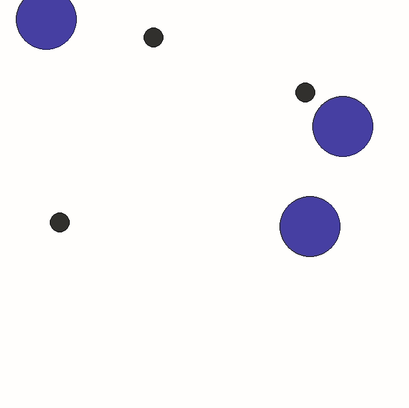

# AASMA group project 2024
## Enviroment [(Simple Spread)](https://pettingzoo.farama.org/environments/mpe/simple_spread/)
This environment has `N` agents, `N` landmarks `(default N=3)`. At a high level, agents must learn to cover all the landmarks while avoiding collisions.

More specifically, all agents are globally rewarded based on how far the closest agent is to each landmark (sum of the minimum distances). Locally, the agents are penalized if they collide with other agents (-1 for each collision). The relative weights of these rewards can be controlled with the `local_ratio` parameter.

Agent observations: `[self_vel, self_pos, landmark_rel_positions, other_agent_rel_positions, communication]`

Agent action space: `[no_action, move_left, move_right, move_down, move_up]`

Below You can see example of random agent behaviour in the environment:

## Training
To start training use `train.py` script. Adjust hyperparameters as well as num of episodes to learn.

Down below You can see used DQNs achitecture for the reinforcement task:

## Testing 
To test trained model use `test.py` script, with correct arguments: `{rl,sp,cp} {rl,sp,cp} {rl,sp,cp} num_of_runs [seeds]`.

Where first 3 values correspond to policies of 3 agents: 
- `rl` - reinforcement learning policy
- `sp`- simple policy
- `cp` - complex policy

Than You should pass number of runs you want to test on.

Lastly You can choose seeds for your runs or You can leave it empty for random seeds. Number of seeds must correspond to number of runs.

Make sure models are named correctly and in the right folder.
Repository contains pre-trained models to see possible results named `agent_X.pt`, X is the agent number.

## Policies

- ### Simple policy
    Agents choose and go to the closest landmark along X and Y axis. Agents choose longer axis first.

    

- ### Complex policy
    Agents are coordinating where to go based on closest distance from agent to landmark.

    

- ### Independent DQL
    Agents were trained using Deep Q-Learning (DQL) with 3 sets of convolutional neural networks (CNN), one set for each agent. 

    

## Results
Here are best results achived using DQN for 7 different runs:

## Requirements 
- Pettingzoo environment -  `pip install 'pettingzoo[mpe]' == 1.24.3` 
- PyTorch - `pip install torch == 2.2.2`
- NumPy - `pip install numpy`
- SciPy - `pip install scipy`